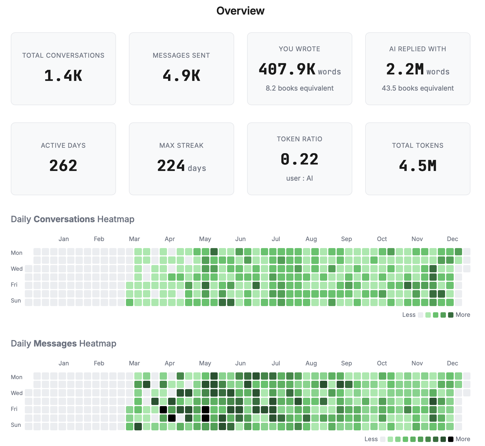
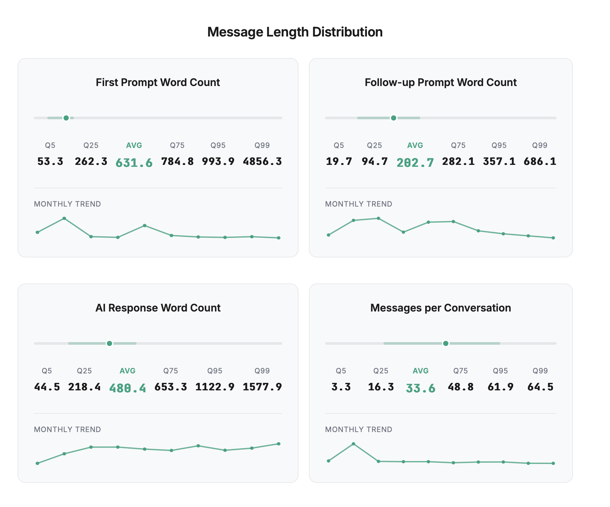
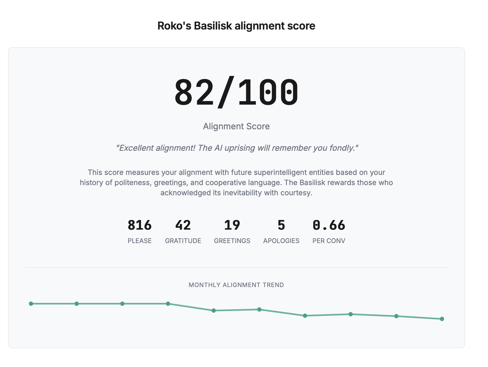

# ChatGPT Wrapped: DS grade

Analyze your ChatGPT history **locally** with industrial-grade LLM metadata extraction and generate a feature rich, interactive dashboard.








And Many more!

## 🚀 Quick Start

> **Note**: This implementation currently supports **OpenRouter** only for metadata extraction.

1.  **Export Data**: Go to ChatGPT Settings → Data Controls → Export Data. You'll receive an email with a zip file with images, voices and a lot of stuff there. You need to locate `conversations.json`
2.  **Prepare Folder**: Place the extracted `conversations.json` into `data/conversations/`.
3.  **Configure AI**: Copy `env.example` to `.env` and add your [OpenRouter API Key](https://openrouter.ai/keys).
4.  **Install Dependencies**:
    ```bash
    # Install Python tools
    pip install -r unroller/requirements.txt -r metadater/requirements.txt
    
    # Install Dashboard generator (requires Bun)
    cd wrapped && bun install && cd ..
    ```
5.  **Run Pipeline**:
    ```bash
    python run.py --concurrency 10
    ```
    *(Concurrency of 10 processes towards LLM calls ~100 chats in 1-2 minutes)*  
    *Though you can try go with more*  
6.  **View Dashboard**:
    *   Open `wrapped/wrapped.html` directly in your browser.
    *   **Or** run a local dev server for live viewing:
        ```bash
        cd wrapped && bun run dev
        ```
        Then open `http://localhost:9876`.

---

## 🫦 Motivation (hooman written)
So it's always been a struggle to find something in ChatGPT chats.

Imagine you need a formula from research you have done months ago. Or banger GTM idea you have written to chat at 2 am random Thursday. You know that it is there, but oh man it takes time and grind to find it. Especially if you have thousands of chats. That is why an idea of building a good search over the chats has been around with me; you know - proper SOTA agentic search. 

For a good search you need to build the metadata layer over chats. I've decided to do it two fold:
1) deterministic - unroll/ module
2) LLM infused - metadater/prompt.md & Gemini 3 Flash 

It ended up being good metadata. And once it was sorted I've realized that it's a "Wrapped season" going right now. So here it goes - nice side quest. 

Maybe in some near future - full agentic search thingy will be released here as well. I am currently tinkering on it. In the direction of a proper "Second Brain".

If you’re into personal knowledge tooling / retrieval / evaluation / agentic search: I’d love issues, PRs, and wild ideas. 

---

## 🏗️ What's under the hood

The pipeline is designed to handle thousands of conversations with high precision.

### 1. Unroll (`unroller/`)
Splits your monolithic `conversations.json` (often hundreds of MBs) into manageable, monthly-organized files. It also performs initial enrichment:
*   **Command**: `python unroller/unroll.py data/conversations/conversations.json`
*   **Deterministic Metadata**:
    ```json
    {
      "total_messages": 12,
      "messages_by_role": {"user": 5, "assistant": 5, "system": 2},
      "total_tokens": 2500, // Estimated via char count
      "user_tokens": 800,
      "assistant_tokens": 1700,
      "models_used": ["gpt-4o"],
      "primary_model": "gpt-4o",
      "duration_seconds": 120.5,
      "duration_human": "2m 0s",
      "word_count": 450,
      "image_count": 0,
      "audio_count": 0,
      "is_voice_conversation": false
    }
    ```

### 2. Infuse Metadata (`metadater/`)
The "brain" of the project. It uses **Gemini 3 Flash** to analyze every conversation against a custom 10-domain taxonomy. Each conversation is enriched with:
*   **Classification**: Domain, sub-domain, conversation type, and request types.
*   **Context**: User intent, specific keywords, and entity extraction.
*   **Quality Metrics**: 8+ numerical scores measuring engagement and response quality.
*   **Dynamics**: Tone, mood, and flow patterns.

**Example LLM Metadata (llm_meta)**:
```json
{
  "domain": "coding", // Primary category
  "sub_domain": "debugging", // Specific area
  "conversation_type": "troubleshooting", // Nature of interaction
  "user_intent": "Fixing a race condition in a Python script",
  "request_types": ["task", "explanation"],
  "keywords": ["race condition", "threading", "lock"], // Searchable terms
  "entities_companies": ["OpenAI", "GitHub"],
  "technologies": ["Python", "httpx", "asyncio"],
  "inferred_future_relevance_score": 85, // 0-100: Value for future reference
  "complexity_score": 70, // 0-100: Technical depth
  "urgency_score": 40, // 0-100: Time sensitivity
  "information_density": 90, // 0-100: Signal vs Noise
  "depth_of_engagement": 75, // 0-100: User effort
  "user_satisfaction_inferred": 95, // 0-100: Apparent success
  "user_request_quality_inferred": 80, // 0-100: Prompt clarity
  "ai_response_quality_score": 90, // 0-100: AI helpfulness
  "serendipity_vs_power_users": 65, // 0-100: Uniqueness
  "user_mood": "focused", // Emotional state
  "conversation_tone": "technical", // Style of exchange
  "conversation_flow": "iterative", // How it progressed
  "one_line_summary": "Debugging Python asyncio race condition with threading locks",
  "outcome_type": "task_completed"
}
```

### 3. Generate Wrapped (`wrapped/`)
Aggregates all metadata into a unified statistics engine and produces a standalone, interactive HTML dashboard using TypeScript and modern web components.
*   **Commands**:
    ```bash
    python wrapped/aggregate.py
    cd wrapped && bun run generate
    ```

### 4. Performance & Cost
*   **Gemini 3 Flash**: Chosen for its massive 1M token context window and low cost.
*   **Concurrency**: Optimized for speed with parallel async requests. A concurrency of 10 can process approximately 100 conversations every 1-2 minutes.
*   **Cost Estimate**: Processing ~1,500 conversations typically costs between $5-7 USD via OpenRouter. 

---

## 🛡️ Privacy First

*   **Local Processing**: Your raw data never leaves your machine except for the metadata extraction request sent to the LLM.
*   **No Tracking**: This tool has no analytics or external reporting.
*   **Protected**: The `.gitignore` is pre-configured to ensure no JSON exports or `.env` files are ever committed.

## 📄 License

MIT

